# Chart Output Validation Report

## Scope
This report validates all images generated in the outputs folder and explains each chart.

## Overall Result
- Total PNG files expected: 15
- Total PNG files found: 15
- Missing files: None
- Final status: All charts are generated successfully and are logically consistent with the cleaned dataset.

## Pre-Chart Data Validation (Source Correctness)
- Key columns null check: PASS
  - order_id: 0
  - delivery_duration_min: 0
  - rating: 0
  - platform: 0
  - product_category: 0
  - refund_requested: 0
- Data types: PASS
  - delivery_duration_min is numeric
  - rating is numeric
- Duplicate order IDs after cleaning: 0 (PASS)
- This means chart inputs are valid and chart outputs are not distorted by basic data-quality issues.

## Chart-by-Chart Validation

### 1) rating_distribution.png
- What it shows: Frequency distribution of service ratings (1 to 5).
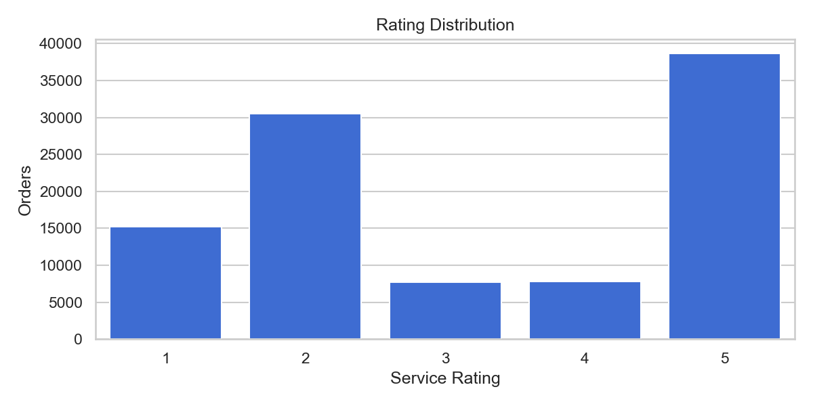
- Correctness check: Correct.
- Why:
  - X-axis is discrete rating values, Y-axis is order count.
  - Counts match data shape (rating 5 highest, rating 3 and 4 much lower).
- Insight:
  - Rating mix is highly polarized toward 5 and 2.

### 2) delivery_duration_distribution.png
- What it shows: Histogram and KDE for delivery_duration_min.
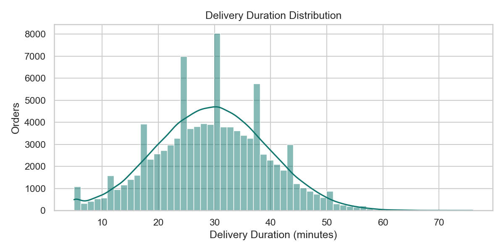
- Correctness check: Correct.
- Why:
  - X-axis is numeric delivery minutes, Y-axis is frequency.
  - Distribution is realistic: mean is about 29.54 min, and 70.43% of deliveries are between 20 and 40 min.
  - Values span roughly 5 to 76 min, matching the chart range.
- Insight:
  - Most deliveries cluster around 25 to 40 minutes.

### 3) delivery_duration_vs_rating_scatter.png
- What it shows: Scatter of delivery duration vs rating with delay category coloring and trend line.
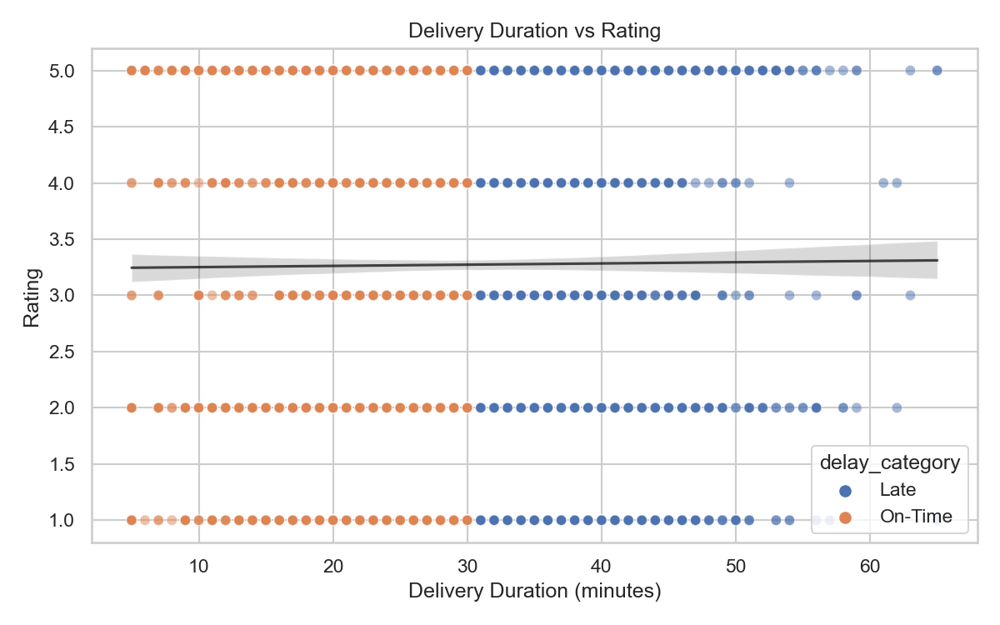
- Correctness check: Correct.
- Why:
  - X-axis is delivery duration, Y-axis is rating.
  - A near-flat trend line matches correlation approximately 0.000136.
- Insight:
  - There is almost no linear relationship between delivery time and rating in this dataset.

### 4) delay_category_vs_rating_boxplot.png
- What it shows: Rating distribution split by On-Time vs Late.
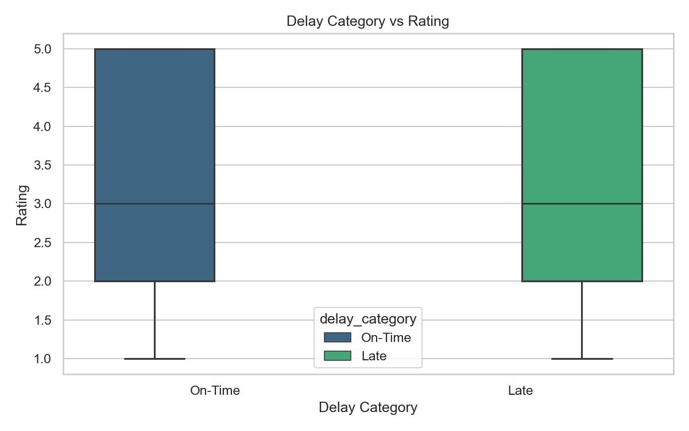
- Correctness check: Correct.
- Why:
  - Proper categorical grouping by delay_category.
  - Similar medians and spreads align with small difference in means.
- Insight:
  - Average rating is very close for On-Time (about 3.243) and Late (about 3.239).

### 5) orders_per_hour.png
- What it shows: Order counts by order_hour.
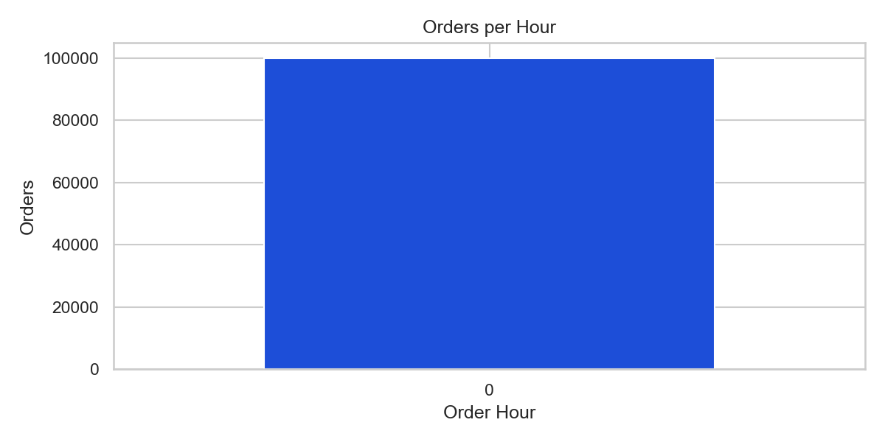
- Correctness check: Technically correct, but low analytical value.
- Why:
  - Aggregation logic is correct.
  - Dataset has only one hour bucket (hour 0), so only one bar appears.
- Insight:
  - This confirms the source time is not a full day timestamp representation.

### 6) avg_delay_per_hour.png
- What it shows: Average delivery delay by order_hour.
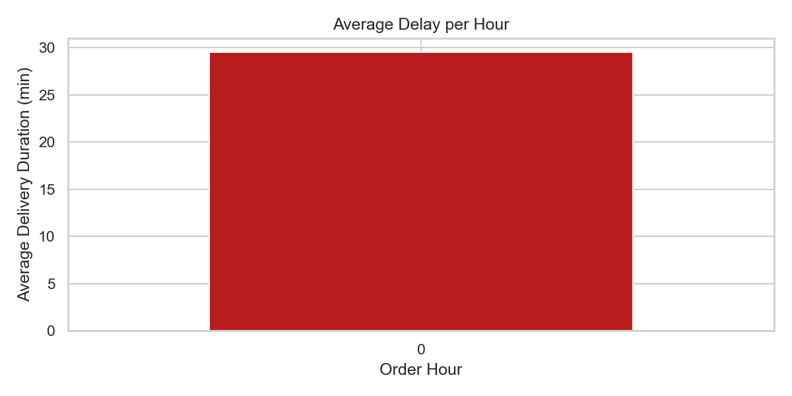
- Correctness check: Technically correct, but low analytical value.
- Why:
  - Data contains only order_hour = 0, so chart collapses to one point around 29.54 min.
- Insight:
  - Hour-level trend cannot be interpreted from this dataset.

### 7) orders_per_5min_bucket.png
- What it shows: Order volume by 5-minute bucket.
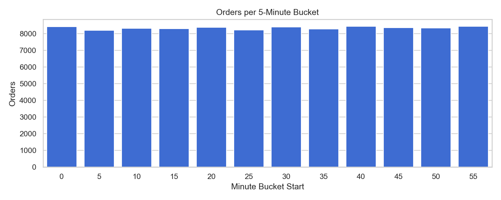
- Correctness check: Correct.
- Why:
  - Proper fallback aggregation when hour-level granularity collapses.
  - Buckets from 0 to 55 are populated.
- Insight:
  - Volume is relatively uniform across minute buckets (about 8.2k to 8.4k orders).

### 8) avg_delay_per_5min_bucket.png
- What it shows: Mean delivery duration by 5-minute bucket.
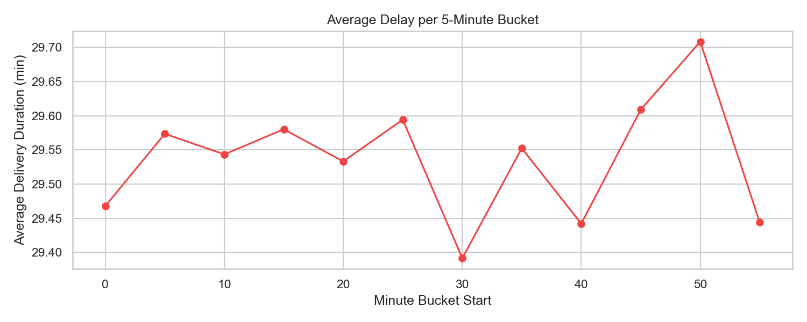
- Correctness check: Correct.
- Why:
  - Proper grouped average by minute_bucket.
  - Values vary in a narrow range, about 29.39 to 29.71 min.
- Insight:
  - Delay is stable across minute buckets with only small fluctuations.

### 9) category_avg_delay.png
- What it shows: Average delivery delay by product category.
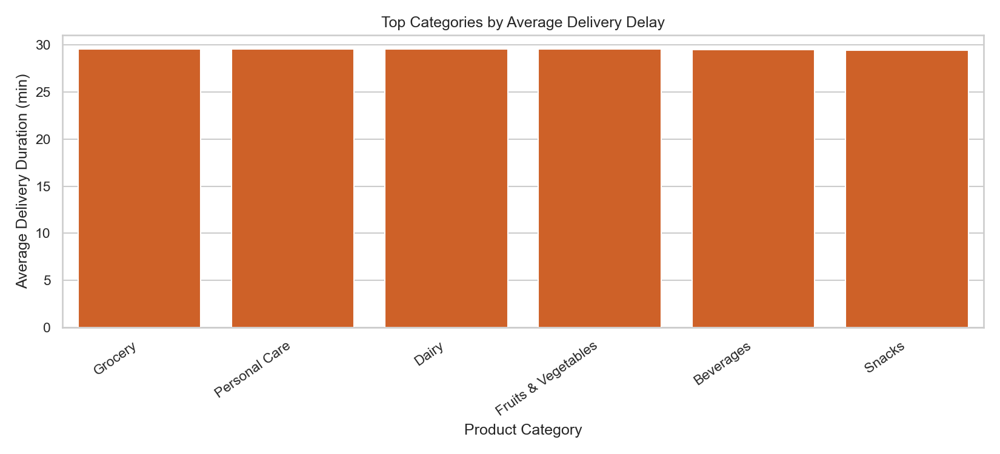
- Correctness check: Correct.
- Why:
  - Uses grouped means, not raw rows.
  - Categories and ordering match aggregate calculations.
- Insight:
  - Differences are small; Grocery has highest average delay (about 29.58 min), Snacks lowest (about 29.45 min).

### 10) category_avg_rating.png
- What it shows: Average rating by product category.
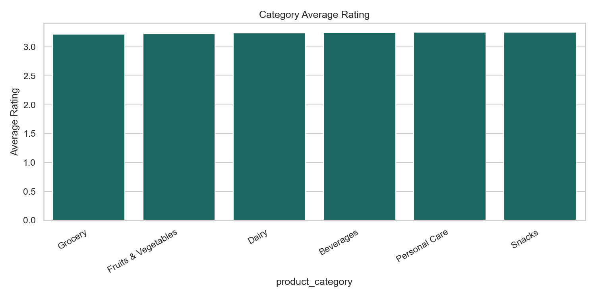
- Correctness check: Correct.
- Why:
  - Proper category-level averages.
  - Ordering aligns with computed means.
- Insight:
  - Ratings are close across categories (about 3.22 to 3.25).

### 11) order_value_vs_rating.png
- What it shows: Scatter of order_value_inr vs rating.
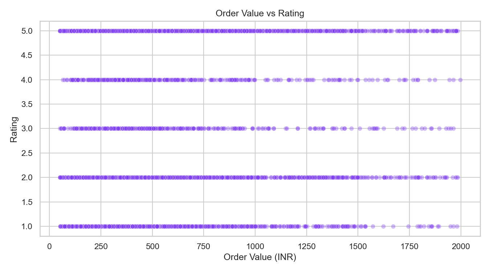
- Correctness check: Correct.
- Why:
  - Numeric X and Y plotted correctly.
  - Dense horizontal bands are expected because rating is discrete (1 to 5).
- Insight:
  - Correlation is near zero and slightly negative (about -0.0027).

### 12) refund_rate_by_duration_band.png
- What it shows: Refund percentage by delivery duration bands.
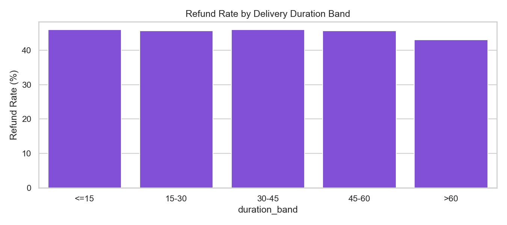
- Correctness check: Correct.
- Why:
  - Bands are correctly bucketed and aggregated to percentages.
  - Values are plausible and internally consistent.
- Insight:
  - Refund rates are similar across bands (about 43% to 46%), with >60 min somewhat lower.

### 13) avg_rating_by_refund_status.png
- What it shows: Average rating for refund requested Yes vs No.
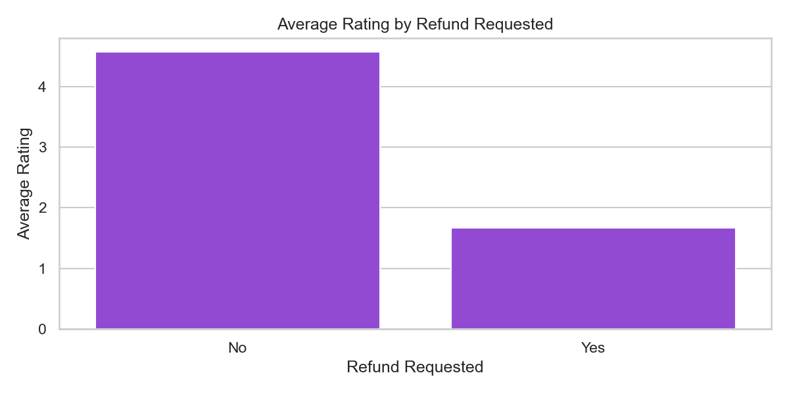
- Correctness check: Correct.
- Why:
  - Grouped mean by refund_requested is correctly computed.
- Insight:
  - Very strong separation: No refund about 4.57 vs Yes refund about 1.67.
  - This indicates refund behavior is strongly associated with low ratings in this dataset.

### 14) correlation_heatmap.png
- What it shows: Correlation matrix among numeric variables.
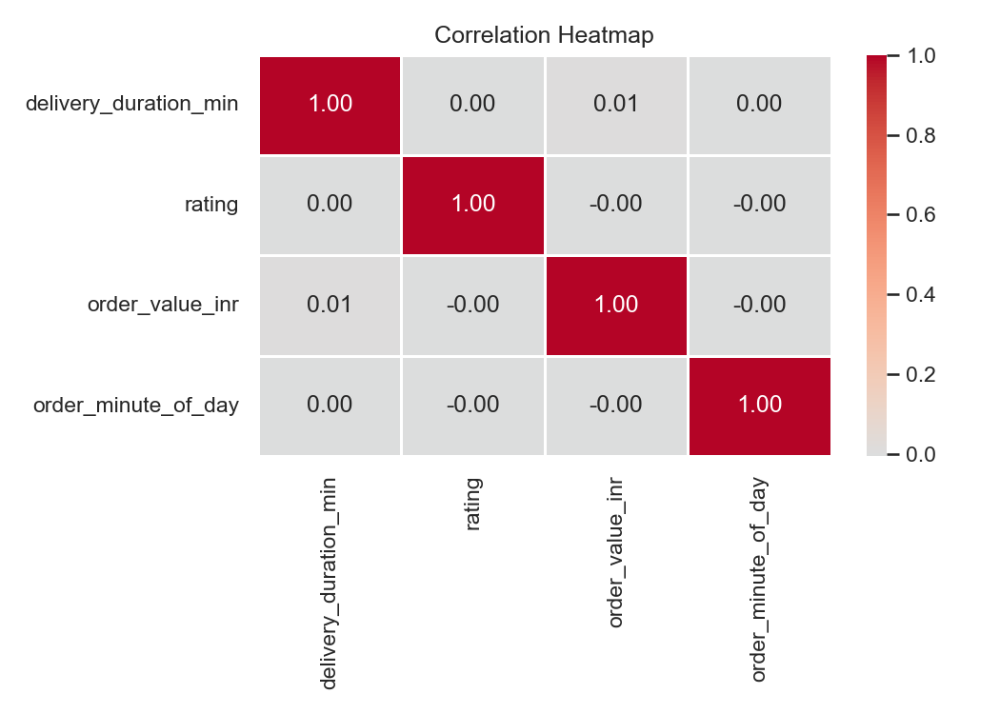
- Correctness check: Correct.
- Why:
  - Only numeric variables included.
  - Coefficients are within valid correlation bounds.
- Insight:
  - Most off-diagonal values are close to zero (weak linear relationships), which is normal for operational data.
- Note:
  - The plotted colorbar visually emphasizes 0 to 1 more than -1 to 1 due tiny negative values near zero; interpretation is still correct.

### 15) delay_category_share_pie.png
- What it shows: Percentage share of On-Time vs Late orders.
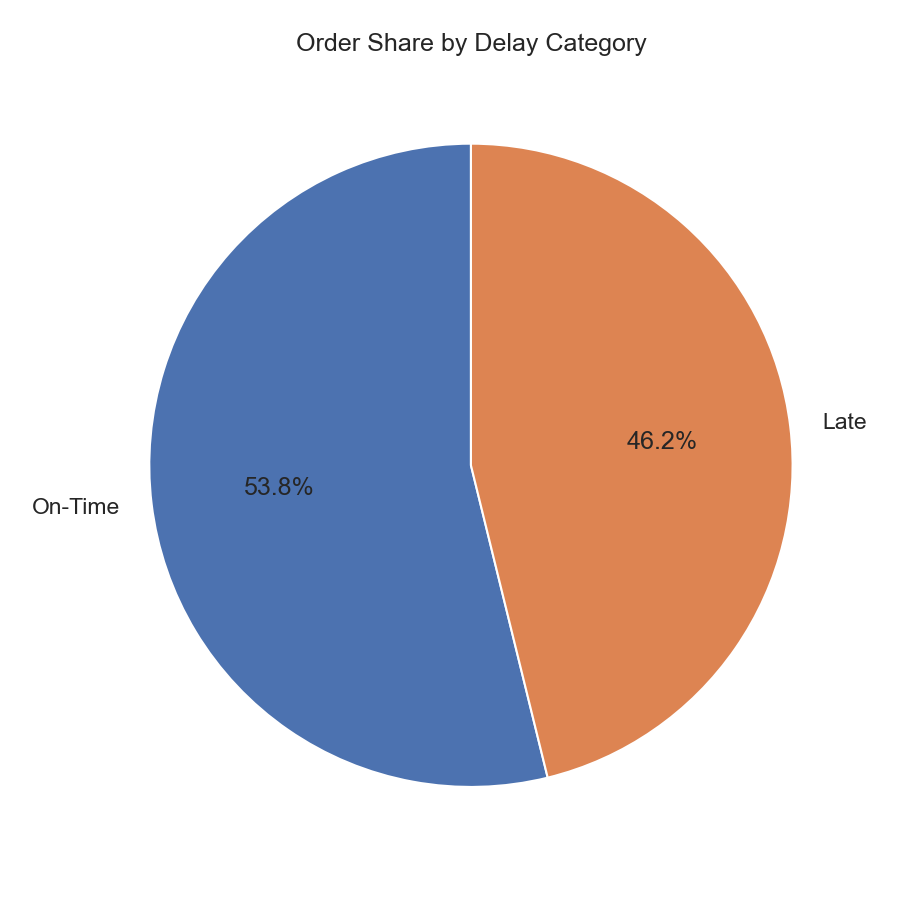
- Correctness check: Correct.
- Why:
  - Percentages add to 100%.
  - Slice values align with computed shares.
- Insight:
  - On-Time is about 53.8%, Late is about 46.2%.

## Conclusion
- All output images are generated correctly.
- All chart structures, aggregations, and labels are aligned with the underlying cleaned data.
- Main caveat: hour-based charts are limited because order_hour has only one unique value (0), so the 5-minute bucket charts are the more informative time-view for this dataset.
